# World ID Gaming Demo Research

**Date:** 2026-07-11  
**Status:** Research and recommendation only. No architecture decision or implementation is accepted by this file.  
**Question:** What is the smallest credible 48-hour localhost demo that preserves the proposed AgentVisa issuer role without pretending current World tooling supports arbitrary third-party credentials?

## Verdict

**Recommended demo:** World-gated enrollment into AgentVisa's existing Semaphore v4 credential, followed by one Semaphore presentation per game and a narrow game-signed reward claim on Arbitrum Sepolia.

This is not a World-native AgentVisa credential. It is an AgentVisa Semaphore Credential issued after a World-backed or synthetic platform Enrollment Authorization. The distinction must be visible in the UI and pitch.

The current evidence does **not** support claiming that AgentVisa can issue an arbitrary reusable credential into production World App or request that credential through stable IDKit:

- The protocol has permissionless issuer-schema registration and credential primitives.
- The published `world-id-issuer` crate registers a schema but does not provide a production issuance or end-user enrollment service.
- The repository's only HTTP issuer is named `faux-issuer` and documents itself as a testing mock.
- IDKit 4.2.1 hard-codes four credential types: `proof_of_human`, `selfie`, `passport`, and `mnc`, with fixed issuer-schema IDs.
- Current developer documentation exposes RP registration, request signing, proof requests, hosted verification, and World-defined credential presets. It does not expose general third-party issuer onboarding, credential delivery, or credential import into World App.
- The point-in-time v4 specification says the initial web authenticator does not support credential enrollment.

**Confidence:** HIGH for the tooling gap and Arbitrum deployment findings, MEDIUM for the recommended 48-hour estimate because a real Developer Portal staging RP and simulator flow still need an executable spike.

## Product correction

World ID already supplies a production path for one-person-per-game registration using a fixed RP/action nullifier and, separately, session continuity. If the gaming platform only needs one account per World ID and wallet-switch-resistant bans, direct IDKit registration is smaller than inserting AgentVisa.

AgentVisa adds product value only if the platform requires a separate, reusable admission credential derived from a platform-selected source or policy. The interested platform should confirm this before production design. Otherwise AgentVisa should be the integration layer, not a second issuer.

## Recommended 48-hour architecture

### Credential and registration model

1. A staging World ID proof or clearly synthetic platform decision creates a signed **Enrollment Authorization**.
2. The browser creates a Semaphore identity locally and sends only its identity commitment with the authorization.
3. AgentVisa verifies the source signature, source policy, subject binding, expiry, and unused nonce.
4. AgentVisa atomically consumes the authorization and adds the commitment to one AgentVisa gamer group. Membership is the reusable **Credential**.
5. For each game, the browser produces one Semaphore proof:
   - `scope = H("agentvisa.game-registration.v1", stableGameId)`
   - `message = H("agentvisa.game-account.v1", stableGameId, loginPublicKey)`
   - the scope deliberately excludes wallet, username, season, and registration attempt.
6. The game verifies the proof once and atomically inserts the nullifier under a unique `(stableGameId, nullifier)` constraint while creating the game account.
7. Routine login, play, win, ban, and claim use the game account and its application authentication key. They do not request another personhood or membership proof.
8. A second wallet can change the requested payout address, but it cannot change the game scope or Semaphore identity. Re-registration produces the same nullifier and fails.
9. A game-local ban changes the game account status and invalidates its application sessions. It does not revoke the reusable AgentVisa Credential.
10. An unbanned winning game account receives one EIP-712 reward authorization. A minimal Arbitrum Sepolia contract consumes the claim ID and records synthetic reward points.

The World enrollment action must also be fixed. If the World proof is the source decision, its action must not vary by wallet or attempt. AgentVisa must uniquely consume its returned World nullifier so one World ID cannot enroll multiple Semaphore identities.

### Component and data flow

```mermaid
flowchart LR
    W[World staging proof or synthetic platform adapter]
    EA[Signed Enrollment Authorization]
    I[AgentVisa issuer service]
    SI[Semaphore identity secret in browser]
    SG[AgentVisa Semaphore gamer group]
    GP[Game registration proof]
    G[Game backend and transactional store]
    OP[Game operator]
    RA[Reward authorizer]
    A[Arbitrum Sepolia GameRewardClaim]

    W --> EA
    SI -->|identity commitment only| I
    EA --> I
    I -->|consume authorization nonce| I
    I -->|add commitment| SG
    SI -->|game-scoped proof| GP
    SG -->|group root| GP
    GP -->|verify once and consume nullifier| G
    G -->|application session| G
    OP -->|manual bot flag and game-local ban| G
    G -->|authenticated unbanned winner| RA
    RA -->|EIP-712 claim authorization| A
```

### Why this is the smallest credible choice

- The repository already has pinned Semaphore 4.14.2 identity, group, proof, verifier, root-history, and replay behavior passing locally.
- Official Semaphore v4 contracts are deployed on Arbitrum One and Arbitrum Sepolia.
- It preserves the requested AgentVisa **Credential Issuer** role without pretending AgentVisa can currently provision a custom credential into World App.
- The game sees a game-scoped nullifier, not the World enrollment nullifier or a global player identifier.
- It keeps World verification at issuance and does not add a second World proof during play or claim.
- It avoids World circuits, World registries, OPRF services, authenticators, recovery, bridges, and verifier deployment.

### What it does not solve

- A recovered World ID does not automatically recover a lost Semaphore identity.
- Reissuing membership to a new Semaphore identity can evade old game nullifiers unless production migration preserves each game's ban state.
- Credential lending and collusion remain possible.
- A person with two accepted World IDs can obtain two credentials unless the selected source prevents that.
- The issuer can add unauthorized group members.

These are production blockers, not details to hide behind the demo.

## Exact localhost pages and journey

### `http://localhost:3000/enroll`

Displays:

- “Synthetic platform authorization” or “World staging simulator proof,” never “AgentVisa verified this human.”
- source, uniqueness domain, schema, assurance label, issued/expiry times, nonce, and opaque subject.
- local Semaphore commitment, never the identity secret.
- authorization signature checks and nonce status.
- “Issue AgentVisa Semaphore gamer credential.”

Prepared outcomes:

- valid issuance succeeds;
- replayed authorization fails;
- expired, wrong-source, wrong-domain, or substituted-commitment authorization fails.

### `http://localhost:3000/games/robot-rally`

Displays:

- connected login/payout wallet selector for Wallet A and Wallet B;
- Join Game;
- game-scoped pseudonym and credential-backed status;
- Play, Record Win, and Claim Synthetic Reward;
- transaction link and claim replay result when Arbitrum Sepolia is enabled.

Journey:

1. Alex selects Wallet A and registers.
2. The game verifies one Semaphore proof and creates `player_alex_game_scope`.
3. Alex plays. No proof is requested.
4. After the operator ban, Alex selects Wallet B and a new username.
5. Join Game produces the same game nullifier and returns “This credential's Robot Rally account already exists and is banned.”
6. Blair, a separately enrolled synthetic player, registers, plays, wins, and claims.

### `http://localhost:3000/operator/robot-rally`

Displays:

- game-scoped pseudonymous accounts only;
- credential-backed, active/banned, and winner status;
- “Flag bot activity” and “Ban account”;
- the failed re-entry attempt;
- no World nullifier, Semaphore identity commitment, raw session ID, PII, or cross-game identifier.

### `http://localhost:3000/audit`

Displays an ordered, redacted event timeline:

- enrollment authorization accepted and consumed;
- Credential issued;
- game nullifier accepted or duplicate;
- game account created, played, won, or banned;
- reward authorization issued and claim ID consumed;
- explicit labels for simulated, trusted off-chain, locally verified, and Arbitrum-confirmed steps.

The demo can present these pages as four routes in one localhost process. In production, issuer, game, operator, and audit responsibilities must be separated.

## Minimal state and atomicity

The logical store needs these records, whether implemented later with SQLite for the demo or the platform's database in production:

- `enrollment_authorizations`: source ID, domain, opaque subject digest, credential commitment, nonce, expiry, consumed time; unique `(sourceId, nonce)`.
- `credentials`: AgentVisa group ID, identity commitment, source/schema/assurance metadata, status, issued/expiry time; never the identity secret.
- `game_accounts`: random account ID, stable game ID, registration nullifier, login public key, payout wallet, credential policy snapshot, active/banned status; unique `(stableGameId, registrationNullifier)`.
- `game_sessions`: hashed opaque token or login-key binding, account ID, expiry, revoked time.
- `wins`: stable result ID, account ID, game ID, status.
- `reward_claims`: claim ID, result ID, recipient, amount/points, chain ID, contract, expiry, issued/claimed status; globally unique claim ID.

Proof verification, nullifier insertion, and game-account creation must be one transaction. Authorization-nonce consumption and group admission must also be one transaction or idempotent state machine. A check-then-insert sequence without a database uniqueness constraint is not credible.

## Upstream packages and availability

### World ID protocol

Current source inspected at commit `9d8b18d0c2cefcaa98b1455dd4da6632076dace2` on 2026-07-11. The latest release commit is `fd01ce7604753353b8710f16de0cf91ddf7fbfaf`, tagged `0.13.0` for the six protocol crates on 2026-07-09.

| Package/crate            | Current version | Licence | Use here                                                                                             |
| ------------------------ | --------------: | ------- | ---------------------------------------------------------------------------------------------------- |
| `world-id-primitives`    |          0.13.0 | MIT     | Reference canonical credential, nullifier, session, and request types. Do not reimplement them.      |
| `world-id-core`          |          0.13.0 | MIT     | Reference authenticator/proof orchestration. Do not embed it in the 48-hour web demo.                |
| `world-id-authenticator` |          0.13.0 | MIT     | Production authenticator building block, not a ready World App credential-enrollment integration.    |
| `world-id-issuer`        |          0.13.0 | MIT     | Registers issuer schemas. It does not expose a complete production issuance/enrollment service.      |
| `world-id-proof`         |          0.13.0 | MIT     | Protocol proof implementation. Do not fork or call directly when IDKit/hosted verification suffices. |
| `world-id-registries`    |          0.13.0 | MIT     | Contract bindings and EIP-712 registry utilities. Not needed for the demo.                           |

Version 0.13.0 is less than seven days old on the research date and fails this repository's normal dependency-age preference. No protocol Rust crate is needed for the recommendation.

### IDKit

| Package                       | Version | Published UTC | Licence | Decision                                                          |
| ----------------------------- | ------: | ------------- | ------- | ----------------------------------------------------------------- |
| `@worldcoin/idkit`            |   4.2.0 | 2026-07-01    | MIT     | React request/session UI candidate after review.                  |
| `@worldcoin/idkit-core`       |   4.2.1 | 2026-07-01    | MIT     | Headless browser/WASM request API and pure signing/hash subpaths. |
| `@worldcoin/idkit-server`     |   1.1.1 | 2026-04-08    | MIT     | Server-side `signRequest` candidate.                              |
| `@worldcoin/idkit-standalone` |   2.2.5 | 2025-10-02    | MIT     | Do not use. Current migration docs say it is discontinued.        |

Stable APIs verified in source:

- `IDKit.request`, `IDKit.createSession`, and `IDKit.proveSession`;
- `CredentialRequest`, `any`, `all`, and `enumerate`;
- `proofOfHuman`, `passport`, `mnc`, `identityCheck`, and legacy presets;
- `signRequest` from the server or `/signing` export;
- backend forwarding of the unmodified result to `POST https://developer.world.org/api/v4/verify/{rp_id}`.

Production IDKit requires a Developer Portal `app_id`, registered `rp_id`, and server-held RP signing key. Staging uses the World simulator and must set `environment: "staging"`. The signing key must never reach browser code or logs.

### Existing Semaphore credential layer

| Package                         | Pinned version | Licence | Availability                                                                  |
| ------------------------------- | -------------: | ------- | ----------------------------------------------------------------------------- |
| `@semaphore-protocol/contracts` |         4.14.2 | MIT     | Already installed and exercised locally; official Arbitrum deployments exist. |
| `@semaphore-protocol/identity`  |         4.14.2 | MIT     | Already installed; keep the secret in the browser.                            |
| `@semaphore-protocol/group`     |         4.14.2 | MIT     | Already installed; use for the group mirror.                                  |
| `@semaphore-protocol/proof`     |         4.14.2 | MIT     | Already installed; generate and verify standard proofs.                       |
| `@zk-kit/semaphore-artifacts`   |         4.13.0 | MIT     | Already pinned trusted-setup artifacts selected by Semaphore.                 |

Official Semaphore v4 deployment addresses on both Arbitrum One and Arbitrum Sepolia:

- `SemaphoreVerifier`: `0x4DeC9E3784EcC1eE002001BfE91deEf4A48931f8`
- `PoseidonT3`: `0xB43122Ecb241DD50062641f089876679fd06599a`
- `Semaphore`: `0x8A1fd199516489B0Fb7153EB5f075cDAC83c693D`

The official v4 trusted setup completed with more than 400 participants on 2024-07-13. The official documentation links PSE and Veridise audits, but this research did not establish a one-to-one audit report mapping for every 4.14.2 package file. Treat that mapping as a production due-diligence item.

## Audits and deployment evidence

### World ID audits

1. **Least Authority, OPRF Circom Circuits, final 2026-01-26.** Six issues, four medium and two low, plus three suggestions were resolved. The report says verifier-side checks were outside its first scope and recommends a complete verifier assessment.
2. **Nethermind, World ID contracts, final 2026-02-24.** Scope includes `WorldIDRegistry`, `WorldIDVerifier`, `RpRegistry`, `CredentialSchemaIssuerRegistry`, base and packing libraries. One high, one medium, and one low finding were fixed. Final audited commit: `0b1bbb6`.
3. **Nethermind, Registry and Verifier V2, final 2026-06-26.** One low finding was acknowledged and two informational findings were fixed. Final audited commit: `065a633`. The acknowledged item concerns migration from v1 accounts with authenticator IDs at or above 48.

These reports support reusing the protocol. They do not make the post-audit 0.13.0 release or a new AgentVisa issuer integration automatically audited.

### World ID v4 deployments

Official current core deployment manifests list only World Chain, chain ID `480`:

- production `WorldIDVerifier` proxy: `0x00000000009E00F9FE82CfeeBB4556686da094d7`;
- staging `WorldIDVerifier` proxy: `0x703a6316c975DEabF30b637c155edD53e24657DB`;
- production issuer registry proxy: `0x941239840F4d9668da8be76b568e836b50685d2c`;
- production RP registry proxy: `0xD9A213A92Bca460D56cDbBF4d775b48fB5925BbC`.

The current cross-chain manifest contains production satellites for Base (`8453`), Tempo (`4217`), and Arc (`5042`), plus staging Base and Arc testnet. It contains no Arbitrum One, Arbitrum Sepolia, or Robinhood Chain deployment.

| Network                         | Direct official World v4 verifier/state            | Decision                                                       |
| ------------------------------- | -------------------------------------------------- | -------------------------------------------------------------- |
| Arbitrum One `42161`            | Not found in official docs or deployment manifests | Do not use or claim support.                                   |
| Arbitrum Sepolia `421614`       | Not found in official docs or deployment manifests | Do not use or claim support.                                   |
| Robinhood Chain testnet `46630` | Not found in official docs or deployment manifests | Do not use or claim support.                                   |
| World Chain `480`               | Production and staging manifests present           | Official direct v4 path, but not the requested Arbitrum chain. |

Current legacy v3 Router documentation lists World Chain, Ethereum, Base, Optimism, and Polygon. It does not list Arbitrum. Generic EVM compatibility and a repository cross-chain implementation are not deployment evidence.

## Arbitrum decision

### Recommended responsibility

Use **Arbitrum Sepolia**, not Arbitrum One and not Robinhood Chain, for one narrow synthetic reward claim:

- verify the trusted game's EIP-712 authorization;
- bind chain ID, contract, stable game ID, result ID, claim ID, recipient, synthetic amount/points, and expiry;
- reject an expired authorization;
- consume each claim ID once;
- update state before any external interaction;
- record synthetic points or emit a claim event.

Keep off-chain:

- World proof request and hosted verification;
- Enrollment Authorization verification and nonce consumption;
- AgentVisa Credential issuance and group administration;
- game registration proof verification and nullifier uniqueness;
- game accounts, login sessions, play, wins, bans, appeals, and eligibility policy;
- reward-authorizer checks against the authenticated, credential-backed, unbanned winning account.

The contract must not store World nullifiers, Semaphore identity commitments, raw proofs, World session IDs, PII, bot evidence, or global ban state. It must not infer that the recipient wallet is the unique person.

### Option comparison

| Option                                                             | Finding                                                                                                                         | 48-hour decision                                                                                                 | Production position                                                                                                                           |
| ------------------------------------------------------------------ | ------------------------------------------------------------------------------------------------------------------------------- | ---------------------------------------------------------------------------------------------------------------- | --------------------------------------------------------------------------------------------------------------------------------------------- |
| 1. Off-chain World verification plus narrow Arbitrum authorization | Fully supported through IDKit and hosted `/api/v4/verify`; Arbitrum only trusts the game/AgentVisa signer.                      | Best if the AgentVisa-issued Credential requirement is dropped. Also use its reward-claim pattern with Option 2. | Credible centralized-game integration with disclosed signer trust, HSM, rotation, monitoring, and replay controls.                            |
| 2. World-gated enrollment into existing Semaphore                  | Preserves an AgentVisa-issued reusable credential and has working repository code plus official Arbitrum Semaphore deployments. | **Recommended.** Verify World/synthetic authorization once, issue membership, verify once per game.              | Requires recovery/reissuance continuity, group-admin security, issuer/game separation, and privacy review.                                    |
| 3. Direct World verification on Arbitrum                           | No official v4 World deployment found on Arbitrum One, Arbitrum Sepolia, or Robinhood Chain.                                    | Reject.                                                                                                          | Revisit only after World publishes and supports the exact satellite/verifier, state path, addresses, upgrade authority, and operations model. |

Do not deploy the World cross-chain contracts, run a World relay, copy the World verifier, or invent a state bridge for this demo.

## Trust assumptions and privacy boundaries

### Trusted in the demo

- World Developer Portal hosted verification when real staging IDKit is used.
- The synthetic platform key and AgentVisa issuer/group-admin key.
- The game database, bot decision, account authentication, win result, and reward-authorizer key.
- Arbitrum Sepolia consensus and the selected RPC for transport, with receipts checked on-chain.

### Untrusted or validated at boundaries

- browser payloads, wallet addresses, usernames, proofs, authorization objects, timestamps, signatures, RPC responses, and claim calldata;
- concurrent enrollment, registration, and reward submissions;
- the connected wallet as evidence of personhood.

### Privacy boundaries

- World proof and Enrollment Authorization are visible to AgentVisa, not to games.
- AgentVisa sees the World enrollment nullifier and Semaphore commitment, so it can link issuance to its own source event.
- A game sees a game-scoped Semaphore nullifier and its own game account only.
- Distinct stable game IDs create unlinkable Semaphore nullifiers, assuming the browser does not reuse usernames, login keys, wallets, or analytics identifiers.
- The reward recipient and claim are public on Arbitrum and can correlate the payout wallet with the game result.
- A single demo process is operationally linkable even if its logical records are separated. Production needs separate services, access controls, retention rules, and logs.

Never log or place on-chain the World session ID, World nullifier, Semaphore identity secret, source evidence, identity-to-account mapping, PII, biometrics, or bot evidence.

## Hackathon shortcuts versus production

### Disclosed 48-hour shortcuts

- World simulator or synthetic platform authorization instead of a live production uniqueness source.
- AgentVisa Semaphore Credential instead of a World-native third-party credential.
- Manual bot flag.
- One local process and a small transactional store.
- Prepared synthetic Alex and Blair identities.
- Development issuer and game signing keys injected locally.
- No credential recovery, reissuance, appeal, or ban expiry.
- Synthetic points or event-only reward on Arbitrum Sepolia.
- Hosted World proof verification rather than trustless on-chain World verification.

### Production requirements

- Signed integration contract defining source, uniqueness domain, assurance, expiry, deduplication, recovery, and liability.
- Real production World RP/action configuration and real-device testing.
- Durable serializable transactions and unique constraints.
- Separated issuer, game, operator, and reward-authorizer services.
- HSM-backed keys, rotation, least privilege, monitoring, and incident response.
- Credential recovery/reissuance that cannot reset existing game bans.
- Game-account recovery independent of payout-wallet replacement.
- Bot-ban evidence, notice, appeal, reversal, retention, and false-positive policy.
- Credential expiry/revocation policy at login and claim time.
- Abuse analysis for credential lending, multiple World IDs, source collusion, and compromised game signers.
- Security review of the exact deployed contracts and dependency lock.

## Required spikes before implementation

1. **Developer Portal staging spike, blocking:** create or obtain a staging `app_id`, `rp_id`, and RP signing key; run `proofOfHuman` through the simulator; verify the unmodified payload through `/api/v4/verify/{rp_id}`; record exact nullifier replay behavior.
2. **Signal-binding spike, blocking:** prove that the staging World request can bind the browser-generated Semaphore commitment without changing the fixed enrollment action. The action remains fixed; the commitment belongs in the signal or signed Enrollment Authorization.
3. **Credential type spike, blocking for any World-native issuer claim:** ask World whether arbitrary `issuerSchemaId` values can be enrolled into production World App and requested through supported IDKit. Obtain an end-to-end supported example, not just registry and primitive code.
4. **Semaphore registration spike:** generate one proof for a fixed game scope, verify off-chain, and confirm a second wallet with the same identity produces the same nullifier while a second issued identity does not.
5. **Atomicity spike:** race two enrollment requests and two game registrations; prove one commit and one deterministic duplicate failure.
6. **Arbitrum Sepolia spike:** verify the official Semaphore addresses and bytecode, then decide whether the demo needs on-chain Semaphore validation at all. Default to off-chain validation.
7. **Reward spike:** define the exact EIP-712 reward authorization and prove claim replay, recipient substitution, wrong chain, wrong contract, expiry, and signer substitution fail.
8. **Recovery design, production blocking:** define how World recovery, Semaphore identity loss, credential reissuance, game-account recovery, and existing bans remain continuous.
9. **Audit provenance spike:** map the exact World and Semaphore source revisions used to published audit scopes.

Do not add packages until spikes 1 through 3 determine whether the World staging and issuer paths are actually available.

## Gaming platform integration questions

1. Is an AgentVisa-issued credential a requirement, or is direct World ID admission sufficient?
2. Which entity is the accepted Uniqueness Source, and what exactly is unique: human, World account, document, platform account, or device?
3. Must one credential work across titles, publishers, regions, and seasons?
4. What is the immutable stable game ID, and who controls its lifecycle?
5. Are bans permanent, timed, or appealable? Who can reverse them?
6. Must a ban survive World account recovery, application-account recovery, and credential replacement?
7. Can a player change login and payout wallets without creating a new game account?
8. Does the platform accept a trusted hosted World verifier and game reward signer, or require on-chain verification?
9. What evidence makes an account credential-backed, and when must credential expiry or revocation be rechecked?
10. What bot system emits the decision, and what idempotent event identifies one decision?
11. What is the reward asset, who funds it, who authorizes results, and what claim disputes or clawbacks exist?
12. Which identifiers may AgentVisa retain, for how long, and under which data-protection roles?
13. Does the platform already have account recovery, session invalidation, anti-sharing, and appeal systems AgentVisa should integrate rather than replace?
14. What throughput, latency, geography, mobile, and availability requirements apply to registration day?
15. Will the platform accept the Semaphore second layer for an initial production pilot?

## Explicit reuse versus build

### Reuse unchanged

- IDKit request, RP-signing, simulator, World App transport, and hosted proof verification.
- World-owned credentials, authenticator, account recovery, OPRF nullifiers, registries, circuits, verifier, and services.
- Existing pinned Semaphore identity, group, proof, contracts, verifier, Merkle tree, nullifier, and trusted-setup artifacts.
- Viem and the repository's current Hardhat 3 toolchain.
- Arbitrum Sepolia and official Semaphore deployment if on-chain group verification is later justified.

### Build only the product seam

- typed synthetic Enrollment Authorization and source-policy validation;
- authorization nonce consumption and idempotent issuance state;
- admission of one browser-generated Semaphore commitment;
- stable game-scope derivation;
- transactional game-account, duplicate-nullifier, ban, play, win, and claim state;
- application login-key/session binding;
- minimal game-signed reward authorization and claim contract;
- redacted demo/audit UI.

### Do not build or fork

- World circuits, verifier, Merkle tree, nullifier, OPRF nodes, World registry, authenticator, recovery, credential registry, bridge, relay, or World App;
- custom Semaphore circuit, verifier, Merkle tree, nullifier store, or trusted setup;
- global gamer ID or global blacklist;
- bot detector;
- wallet, bundler, paymaster, bridge, token economy, governance, or upgrade framework;
- another personhood proof for play, win, or claim;
- tournament or reward nullifier when the authenticated game account and unique claim ID already provide continuity and replay protection.

## Sources

- [World ID protocol repository](https://github.com/worldcoin/world-id-protocol)
- [Current protocol source revision](https://github.com/worldcoin/world-id-protocol/tree/9d8b18d0c2cefcaa98b1455dd4da6632076dace2)
- [Protocol documentation authority warning](https://github.com/worldcoin/world-id-protocol/blob/main/docs/README.md)
- [Point-in-time World ID 4.0 specification](https://github.com/worldcoin/world-id-protocol/blob/main/docs/world-id-4-specs/README.md)
- [Core production deployments](https://github.com/worldcoin/world-id-protocol/blob/main/contracts/deployments/core/production.json)
- [Cross-chain production deployments](https://github.com/worldcoin/world-id-protocol/blob/main/contracts/deployments/crosschain/production.json)
- [Protocol audits directory](https://github.com/worldcoin/world-id-protocol/tree/main/audits)
- [World ID 4.0 announcement](https://world.org/blog/engineering/introducing-world-id-4.0)
- [IDKit repository](https://github.com/worldcoin/idkit)
- [IDKit integration guide](https://docs.world.org/world-id/idkit/integrate)
- [IDKit credentials](https://docs.world.org/world-id/idkit/credentials)
- [World ID v4 verify API](https://docs.world.org/world-id/reference/api-v4)
- [World ID on-chain verification](https://docs.world.org/world-id/idkit/onchain-verification)
- [World ID 4.0 migration](https://docs.world.org/world-id/4-0-migration)
- [World RP signatures](https://docs.world.org/world-id/idkit/signatures)
- [Semaphore v4 documentation and audits](https://docs.semaphore.pse.dev/)
- [Semaphore deployed contracts](https://docs.semaphore.pse.dev/deployed-contracts)
- [Semaphore v4.14.2 release](https://github.com/semaphore-protocol/semaphore/releases/tag/v4.14.2)
